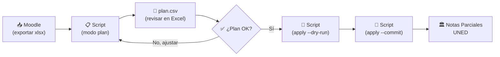
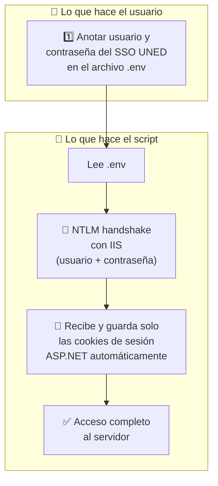
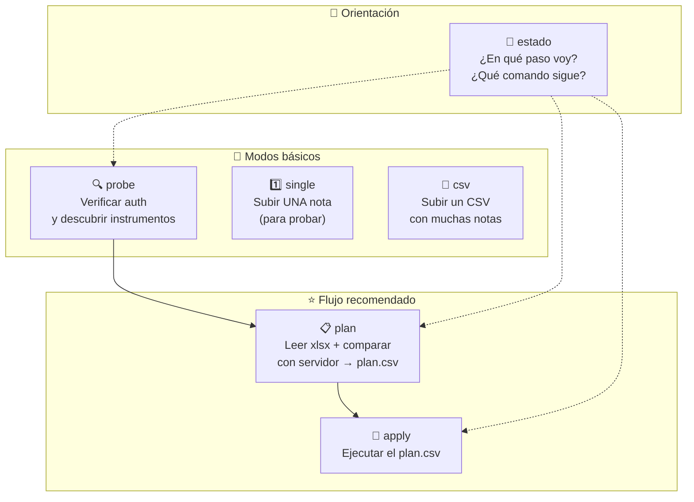
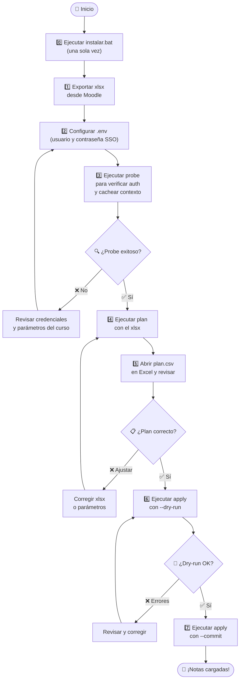
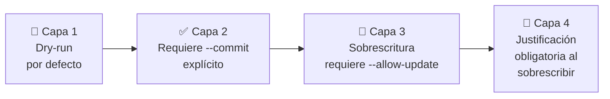

# 📊 Grade Uploader — Notas Parciales UNED

> **Automatiza la subida de notas al sistema oficial de [Captura de Notas Parciales](https://produccion.uned.ac.cr/notasparciales/Formularios/CapturaNotas.aspx) de la UNED Costa Rica.**

En lugar de cargar notas una por una en el navegador, este script lee las calificaciones desde un archivo Excel exportado de Moodle (o un CSV manual) y las sube al sistema de Notas Parciales de forma masiva, segura y auditable.

---

## 📑 Tabla de contenidos

- [🔭 Vista general](#-vista-general)
- [⚙️ Requisitos previos](#️-requisitos-previos)
- [🚀 Instalación](#-instalación)
  - [🩺 Si el instalador falla](#-si-el-instalador-falla)
- [🔑 Configuración de credenciales](#-configuración-de-credenciales)
- [📊 Formato de archivos de entrada](#-formato-de-archivos-de-entrada)
- [🛠️ Modos de uso](#️-modos-de-uso)
  - [🧭 ¿En qué paso voy? (`estado`)](#-modo-estado--en-qué-paso-voy)
- [✅ Flujo recomendado paso a paso](#-flujo-recomendado-paso-a-paso)
- [📖 Referencia de parámetros CLI](#-referencia-de-parámetros-cli)
- [🔒 Seguridad](#-seguridad)
- [🩺 Solución de problemas](#-solución-de-problemas)
- [🛡️ Seguridad de secretos y `.gitignore`](#️-seguridad-de-secretos-y-el-archivo-gitignore)
- [📜 Licencia](#-licencia)

---

## 🔭 Vista general

El sistema de **Notas Parciales** de la UNED (`produccion.uned.ac.cr/notasparciales`) es una aplicación web ASP.NET donde los tutores capturan las calificaciones oficiales de cada instrumento de evaluación (tareas, proyectos, exámenes, etc.).

Este script **replica las mismas llamadas HTTP que hace el navegador**, pero automatizadas desde la línea de comandos. Esto permite:

- ✅ Subir **decenas o cientos de notas** en segundos en lugar de minutos.
- ✅ **Comparar** las notas de Moodle contra las que ya están en el sistema antes de escribir nada.
- ✅ Generar un **plan auditable** (CSV) que se puede revisar en Excel antes de confirmar.
- ✅ Modo **dry-run** por defecto: nada se escribe hasta que se confirme explícitamente.

### 🗺️ Flujo general



### 🔐 Arquitectura de autenticación

El script se autentica **solo con tu usuario y contraseña del SSO UNED**.



| Capa | ¿Qué es? | ¿De dónde sale? |
|------|----------|----------------|
| 🔑 **NTLM** | Autenticación Windows a nivel del servidor IIS | Tu usuario y contraseña del SSO UNED (el mismo de `entornofuncionarios.uned.ac.cr`) |
| 🍪 **Cookies de sesión** | Pase temporal que mantiene viva la sesión ASP.NET | Las emite el servidor durante el handshake NTLM; la librería `requests` las guarda sola. **El usuario no hace nada.** |

---

## ⚙️ Requisitos previos

| Requisito | Detalle |
|-----------|--------|
| 💻 **Sistema operativo** | Windows 10 o Windows 11 (incluyen PowerShell, que usa el instalador) |
| 🐍 **Python 3.10+** | Solo si NO vas a usar el ejecutable `.exe`. Al instalarlo, marcá *"Add Python to PATH"* |
| 🌐 **Cuenta SSO UNED** | Con acceso al sistema de Notas Parciales |
| 📶 **Conexión a internet** | Para instalar las dependencias y para comunicarse con el servidor de la UNED |

> [!TIP]
> Si no tenés Python instalado y no querés instalarlo, podés generar un **ejecutable `.exe`** que incluye todo lo necesario. Vea la sección [🚀 Instalación — Opción B](#opción-b---ejecutable-exe-sin-python).

---

## 🚀 Instalación

### Opción A — 🏃 Instalación automática (recomendada)

1️⃣ Descargá o cloná este repositorio:

```bash
git clone https://github.com/chhdeza/grade-uploader.git
cd grade-uploader
```

2️⃣ Ejecutá el instalador (doble click en el archivo, o escribiendo su nombre en la terminal):

```
instalar.bat
```

Esto hace 5 cosas automáticamente:

| Paso | Qué hace |
|------|----------|
| `[1/5]` | Verifica que tengas Python 3.10 o superior (y te dice cómo instalarlo si no) |
| `[2/5]` | Crea un entorno virtual (`.venv`) para no ensuciar tu Python del sistema |
| `[3/5]` | Instala las dependencias del proyecto |
| `[4/5]` | Crea tu archivo `.env` a partir de la plantilla (no lo sobrescribe si ya existe) |
| `[5/5]` | Verifica que todo quedó funcionando de verdad |

3️⃣ Abrí el archivo `.env` con el Bloc de notas y completá tu usuario y contraseña de la UNED (ver [🔑 Configuración de credenciales](#-configuración-de-credenciales)).

4️⃣ Ejecutá este comando: te va a decir en qué paso estás y cuál es el siguiente.

```
.venv\Scripts\python.exe notasparciales_upload.py estado
```

> [!IMPORTANT]
> 💡 **Usá siempre `.venv\Scripts\python.exe` en lugar de `python` a secas.** Así no hace falta "activar el entorno virtual" en cada terminal nueva — un paso que además puede fallar si Windows tiene restringida la ejecución de scripts.

---

### Opción B — 📦 Ejecutable `.exe` (sin Python)

Si no tenés Python instalado (o preferís no instalarlo), podés generar un ejecutable independiente.

**Para generar el `.exe`:** (requiere Python solo una vez, en cualquier computadora)

```
construir_exe.bat
```

Esto genera `notasparciales_upload.exe` en la carpeta raíz. Después:

1️⃣ Copiá estos 2 archivos a cualquier computadora con Windows:
   - `notasparciales_upload.exe`
   - `.env` (con las credenciales ya configuradas)

2️⃣ Ejecutá desde la línea de comandos. Empezá por `estado`, que te va a indicar el siguiente paso:

```
notasparciales_upload.exe estado
```

Con el `.exe` los comandos son idénticos a los de este README, solo cambia el principio: donde dice `python notasparciales_upload.py`, escribí `notasparciales_upload.exe`.

> [!NOTE]
> El `.exe` pesa aproximadamente 15-25 MB porque incluye Python y todas las dependencias empaquetadas.

---

### Opción C — 🔧 Instalación manual

```bat
REM Crear entorno virtual
python -m venv .venv

REM Instalar dependencias (sin necesidad de activar nada)
.venv\Scripts\pip.exe install -r requirements.txt

REM Crear archivo de configuración
copy .env.example .env

REM Verificar que quedó bien
.venv\Scripts\python.exe notasparciales_upload.py estado
```

> [!TIP]
> No hace falta `activate`: llamando directamente a `.venv\Scripts\pip.exe` y `.venv\Scripts\python.exe` se usa el entorno virtual igual, y funciona aunque Windows tenga restringida la ejecución de scripts de PowerShell.

---

### 🩺 Si el instalador falla

| 🚨 Síntoma | 💡 Causa | ✅ Solución |
|-----------|----------|-----------|
| La ventana se abre y se cierra al instante | Se ejecutó con doble click y hubo un error muy temprano | Abrí una terminal (`Win+R` → `cmd`), navegá a la carpeta con `cd`, y ejecutá `instalar.bat` desde ahí para ver el mensaje completo |
| `ERROR: Python 3.10+ no encontrado` pero **sí** tenés Python | Python se instaló sin marcar *"Add Python to PATH"* | Reinstalá Python marcando esa casilla, o instalalo desde Microsoft Store (que lo agrega solo) |
| `ERROR: No se encontró requirements.txt` | Se descargó solo el `instalar.bat`, no el proyecto completo | Descargá el repositorio entero (botón verde *Code* → *Download ZIP*) y descomprimilo antes de instalar |
| `No se pudieron instalar las dependencias` | Sin internet, o la red de la UNED bloquea el acceso a PyPI | El instalador vuelve a intentar mostrando el error real: leelo y, si menciona un proxy o un timeout, probá desde otra red |
| `no se puede cargar el archivo ... deshabilitada la ejecución de scripts` | Política de ejecución de PowerShell restringida | `instalar.bat` ya la evita con `-ExecutionPolicy Bypass`. Si el error aparece **después**, es porque intentaste usar `.venv\Scripts\activate`: usá `.venv\Scripts\python.exe` directamente |

> [!NOTE]
> El instalador se puede ejecutar **las veces que haga falta**. No borra tu archivo `.env` ni tus notas: si `.venv` ya existe lo reutiliza, y si `.env` ya existe no lo toca.

---

## 🔑 Configuración de credenciales

Toda la configuración se guarda en un archivo llamado **`.env`** en la misma carpeta del script. Este archivo **nunca se sube al repositorio** (está en `.gitignore`).

Abrí el archivo `.env` con cualquier editor de texto (Bloc de notas, VS Code, Notepad++, etc.) y completá **dos valores**. Eso es todo lo que hay que configurar.

Son el **mismo usuario y contraseña** que usás para entrar al [Entorno de Funcionarios UNED](https://entornofuncionarios.uned.ac.cr/).

```ini
# Tu usuario del SSO UNED (sin @uned.ac.cr)
# Ejemplo: si tu correo es jperez@uned.ac.cr, tu usuario es "jperez"
NP_NTLM_USER=jperez

# Tu contraseña del SSO UNED (la misma del correo institucional)
NP_NTLM_PASSWORD=tu_contraseña_aqui
```

> [!IMPORTANT]
> El usuario es **solo el nombre**, sin `@uned.ac.cr`. Por ejemplo: `jperez`, NO `jperez@uned.ac.cr`.

---

## 📊 Formato de archivos de entrada

### 📗 Archivos Excel de Moodle (`.xlsx`) — para modo `plan`

El modo `plan` lee archivos Excel exportados directamente desde Moodle. Así se exportan:

**📥 Cómo exportar el xlsx desde Moodle:**

1️⃣ Entrá a tu curso en Moodle

2️⃣ En el menú de navegación, andá a **Calificaciones**
   - Ruta: *Administración del curso* → *Calificaciones*

3️⃣ En la página de calificaciones, buscá el menú/pestaña **"Exportar"**

4️⃣ Seleccioná **"Hoja de cálculo Excel"**

5️⃣ Seleccioná las actividades que querés exportar y hacé click en **"Descargar"**

**📋 Columnas obligatorias en el xlsx:**

El archivo exportado debe tener estas columnas (Moodle las genera automáticamente):

| Columna | Ejemplo | Descripción |
|---------|---------|-------------|
| `Nombre` | María | Nombre del estudiante |
| `Apellido(s)` | Pérez Solano | Apellidos |
| `Número de ID` | 0117540192 | **Cédula del estudiante** (debe coincidir con Notas Parciales) |
| `Institución` | SAN JOSE (01) | Centro universitario. El número entre paréntesis es el código CU |

**📊 Columnas de notas:**

El script detecta automáticamente las columnas que terminan en `(Real)` o `(Porcentaje)`. Estas son las columnas de calificación que Moodle genera por cada actividad.

**📌 Ejemplo de cómo luce un xlsx exportado:**

| Nombre | Apellido(s) | Número de ID | Institución | Tarea 1 (Real) | Proyecto Final (Real) |
|--------|-------------|-------------|-------------|-----------------|----------------------|
| María | Pérez Solano | 0117540192 | SAN JOSE (01) | 89 | 95 |
| Juan | Rodríguez Li | 0304560789 | DESAMPARADOS (42) | 75 | - |
| Ana | Mora Castro | 0501230456 | SAN JOSE (01) | - | 80 |

> [!IMPORTANT]
> 📌 **Sobre la columna "Número de ID":** este valor **debe ser la cédula del estudiante** y debe coincidir con la que aparece en Notas Parciales. Si en Moodle no está configurado (aparece vacío), el script no podrá mapear a ese estudiante.

> [!NOTE]
> 📌 **Sobre la columna "Institución":** el script extrae el código numérico entre paréntesis (ej: `01` de `SAN JOSE (01)`) para determinar a qué centro universitario pertenece cada estudiante. Esto se combina con el parámetro `--cu-grupo` para saber a qué grupo del sistema pertenece.

**📐 Escala de notas: Moodle (0–100) vs Notas Parciales (0–10)**

```
Moodle:           0 ────────────────────── 100
                  │                          │
                  │    ÷ 10 (automático)     │
                  │                          │
Notas Parciales:  0 ──────────── 10
```

El modo `plan` convierte automáticamente dividiendo entre 10. Por ejemplo: `89` en Moodle → `8.9` en Notas Parciales.

**🔤 Valor especial `-` (guion):**

Si una celda de nota tiene un **guion (`-`)**, el script lo interpreta como **"no presentó el instrumento"** y lo marca con el código 998 en el sistema de Notas Parciales.

---

### 📄 Archivos CSV — para modo `csv`

El modo `csv` usa un archivo CSV simple con las notas **ya en escala 0–10**.

**Formato:**

```csv
cedula,instrumento,nota
0117540192,Tar1,8.9
0304560789,Tar1,7.5
0501230456,Proy1,8.0
```

Columnas opcionales adicionales: `observacion_codigo`, `justificacion`.

> [!WARNING]
> ⚠️ **Diferencia importante:** el modo `csv` espera notas **ya en escala 0–10** (el formato de Notas Parciales). NO hace conversión automática como el modo `plan`. Si tus notas vienen de Moodle en escala 0–100, dividí entre 10 antes de crear el CSV.

---

## 🛠️ Modos de uso

El script tiene 6 modos de operación. Los más comunes para carga masiva son **`plan`** + **`apply`**.

> [!TIP]
> 🧭 **¿Perdido? ¿No sabés cuál es el próximo comando?** Ejecutá:
> ```
> python notasparciales_upload.py estado
> ```
> Te dice en qué paso vas y te da el comando exacto que sigue. No se conecta al servidor, no pide parámetros y no escribe nada. **Cada comando además termina indicándote el siguiente**, así que normalmente alcanza con copiar y pegar lo que el script te muestra.

> [!TIP]
> ⚡ **Flujo simplificado (recomendado):** los parámetros `--escuela`, `--catedra`,
> `--encargado`, `--tutor` y `--modelo` son códigos internos del sistema que
> cuesta recordar y son fáciles de escribir mal (un solo dígito trocado y el
> servidor devuelve "0 estudiantes" sin ningún error). **Solo hace falta
> pasarlos una vez**, en un `probe` exitoso: el script confirma que devuelven
> datos reales y los guarda en `.notasparciales_context.json`, agrupados por
> `--asignatura` + `--ano` + `--pac` + `--tipo`. De ahí en adelante, `single`,
> `csv`, `plan` y `apply` los completan solos — el comando del día a día queda
> así de corto:
> ```bash
> python notasparciales_upload.py plan --ano 2026 --pac 3 --asignatura 00883 --xlsx calificaciones_moodle.xlsx
> ```
> Además, en modo `plan` ya **no hace falta indicar `--cu-grupo`**: los CU se
> leen solos de la columna "Institución" del xlsx, y el grupo de cada uno se
> autodetecta contra el servidor (probando `grupo=1..15`, sin escribir nada, y
> quedándose con el que tenga estudiantes cuya cédula coincide con el xlsx).
> `--cu-grupo CU=GRUPO` sigue existiendo por si necesitás forzar un valor
> manualmente. El archivo de cache **no tiene credenciales** — solo códigos de
> curso — pero igual queda fuera de Git vía `.gitignore`, junto con el
> `.xlsx` y los `plan.csv`, porque contienen datos de estudiantes.



---

### 🧭 Modo `estado` — ¿En qué paso voy?

Si cerraste la terminal, volviste al otro día, o simplemente no sabés qué sigue:

```
python notasparciales_upload.py estado
```

**🖥️ Salida de ejemplo:**
```
══════════════════════════════════════════════════════════════════════
 ESTADO DEL PROCESO DE CARGA DE NOTAS
══════════════════════════════════════════════════════════════════════
 ✓ Credenciales configuradas (.env, usuario: jperez)
 ✓ Cursos verificados: 1
     · 03622  (año 2026, PAC 4)   verificado el 2026-08-19 22:47
 ✓ Plan generado: notas_plan.csv (60 filas, 2026-08-19 22:48)
     · 60 fila(s) pendientes de subir
 ✓ Prueba realizada sin errores (60 fila(s))
 ✗ Todavía no se subió ninguna nota al sistema
══════════════════════════════════════════════════════════════════════
 ▶ SIGUIENTE PASO:

   Ya hiciste la prueba y salió bien. Este comando SÍ escribe
   las notas de verdad en el sistema de la UNED:

   python notasparciales_upload.py apply --ano 2026 --pac 4 --asignatura 03622 --plan notas_plan.csv --commit
══════════════════════════════════════════════════════════════════════
```

> [!NOTE]
> `estado` **solo mira archivos de tu computadora**: no se conecta al servidor de la UNED, no necesita parámetros y nunca escribe nada. Podés ejecutarlo cuantas veces quieras.

---

### 🔍 Modo `probe` — Verificar conexión (y guardar el contexto)

Verifica que tus credenciales funcionan y muestra los instrumentos de evaluación del modelo. **Corré esto una vez por curso** con todos los parámetros — si devuelve instrumentos y estudiantes reales, queda guardado para que los demás modos no te los vuelvan a pedir.

```bash
python notasparciales_upload.py probe --ano 2026 --pac 3 --tipo O --escuela 03 --catedra 253 --encargado ARODRIGUEZP --tutor 0401780367 --asignatura 00883 --cu 42 --grupo 1 --modelo 4
```

**🖥️ Salida esperada:**
```
========================================
AUTENTICACIÓN EXITOSA
========================================

== Nota mínima para 00883 ==
Nota mínima de aprobación: 7

== Instrumentos del modelo ==
Mapeo Codigo -> Nombre del instrumento:
  Tar1     ->  Tarea 1 (2)
  Tar2     ->  Tarea 2 (2)
  Tar3     ->  Tarea 3 (2)
  Proy1    ->  Proyecto 1 (4)

== Cargando tabla del grupo (resumen) ==
Estudiantes en el grupo: 25

✓ Contexto guardado en .notasparciales_context.json para --asignatura 00883
  (ano=2026 pac=3 tipo=O). Las próximas corridas de plan/apply/single/csv
  pueden omitir --escuela/--catedra/--encargado/--tutor/--modelo.
```

> [!TIP]
> 💡 **Siempre empezá con `probe`** para confirmar que las credenciales funcionan antes de hacer cualquier otra operación.
>
> Si en cambio ves **"⚠ ADVERTENCIA: 0 estudiantes"** o **"ningún instrumento de evaluación"**, la sesión sí se autenticó — el problema es que algún parámetro (`--asignatura`, `--modelo`, `--cu` o `--grupo`) no corresponde a un grupo real. El servidor no da error en ese caso, simplemente devuelve tablas vacías, así que si ves eso revisá los valores contra los dropdowns de la página antes de asumir que el script está roto.

---

### 1️⃣ Modo `single` — Subir una nota individual

Ideal para **probar** que todo funciona antes de hacer una carga masiva.

```bash
# Primero con --dry-run (NO escribe nada):
python notasparciales_upload.py single --ano 2026 --pac 3 --tipo O --escuela 03 --catedra 253 --encargado ARODRIGUEZP --tutor 0401780367 --asignatura 00883 --cu 42 --grupo 1 --modelo 4 --cedula 0117540192 --instrumento Tar1 --nota 8.9 --dry-run
```

Si todo se ve bien, ejecutá **sin `--dry-run`** (agregando `--commit`):

```bash
python notasparciales_upload.py single ... --commit
```

---

### 📄 Modo `csv` — Subir un CSV con muchas notas

```bash
python notasparciales_upload.py csv --ano 2026 --pac 3 --tipo O --escuela 03 --catedra 253 --encargado ARODRIGUEZP --tutor 0401780367 --asignatura 00883 --cu 42 --grupo 1 --modelo 4 --upload-csv notas.csv --dry-run
```

---

### 📋 Modo `plan` — ⭐ Generar plan desde xlsx de Moodle

Este es el modo **recomendado** para cargas masivas. Lee el xlsx exportado de Moodle, consulta el estado actual del servidor, y genera un `plan.csv` que podés revisar antes de ejecutar.

Si ya corriste `probe` para esta asignatura+ano+pac, el comando se reduce a esto — ni `--cu-grupo` hace falta, se autodetecta:

```bash
python notasparciales_upload.py plan --ano 2026 --pac 3 --asignatura 00883 --xlsx calificaciones_moodle.xlsx --output notas_plan.csv
```

La primera vez (o si el cache no tiene esta asignatura todavía), pasá todos los parámetros explícitos:

```bash
python notasparciales_upload.py plan --ano 2026 --pac 3 --tipo O --escuela 03 --catedra 253 --encargado ARODRIGUEZP --tutor 0401780367 --asignatura 00883 --modelo 4 --xlsx calificaciones_moodle.xlsx --output notas_plan.csv
```

**¿Cómo se resuelve el CU → grupo si no paso `--cu-grupo`?**

Los CU se extraen solos de la columna "Institución" del xlsx (ej. `"DESAMPARADOS (42)"` → CU `42`). Para cada uno, el script prueba `grupo=1..15` contra el servidor (solo lectura) y se queda con el grupo cuyo roster tenga cédulas que coinciden con las del xlsx para ese CU. Si no encuentra ninguna coincidencia, te lo dice explícitamente en la consola en vez de fallar en silencio, y podés forzarlo a mano:

```bash
--cu-grupo 42=1 --cu-grupo 01=2
```
- `42=1` → CU 42 (Desamparados) = Grupo 1 (forzado, no se autodetecta)
- `01=2` → CU 01 (San José) = Grupo 2 (forzado, no se autodetecta)

Cualquier CU que no pases explícito en `--cu-grupo` se autodetecta; podés mezclar ambos (algunos forzados, el resto automático).

**📄 El plan.csv generado contiene:**

| Columna | Significado |
|---------|------------|
| `cedula` | Cédula del estudiante |
| `instrumento` | Código del instrumento (Tar1, Proy1, etc.) |
| `nota_local` | Nota calculada desde el xlsx (ya en escala 0-10) |
| `nota_remota` | Nota que actualmente tiene el servidor |
| `accion` | Qué va a hacer el script con esta fila |
| `motivo` | Explicación legible de la acción |

**Acciones posibles en el plan:**

| Acción | Significado | ¿Se ejecuta? |
|--------|------------|------------|
| ✅ `upload` | Nota pendiente de cargar | Sí |
| ⚠️ `mark_not_presented` | Marcar como "no presentó" | Sí (salvo `--no-mark-not-presented`) |
| 🔄 `would_overwrite` | Cambiaría una nota existente | Solo con `--allow-update` |
| ⏭️ `skip_already_set` | Ya tiene la misma nota | No (ya está bien) |
| 🚫 `skip_retirado` | Estudiante retirado (994) | No |
| ❓ `skip_not_in_roster` | No está en el grupo del servidor | No |
| 👀 `review` | Caso ambiguo, revisar manualmente | No |

> [!TIP]
> 💡 **Abrí el `plan.csv` en Excel** y revisá las columnas `accion` y `motivo` antes de ejecutar `apply`. Así podés verificar que todo tiene sentido.

---

### 🚀 Modo `apply` — ⭐ Ejecutar el plan

Ejecuta las acciones del `plan.csv` generado en el paso anterior.

```bash
# Primero SIEMPRE en dry-run (con el contexto ya cacheado por probe/plan):
python notasparciales_upload.py apply --ano 2026 --pac 3 --asignatura 00883 --plan notas_plan.csv --dry-run

# Cuando estés seguro, con --commit:
python notasparciales_upload.py apply --ano 2026 --pac 3 --asignatura 00883 --plan notas_plan.csv --commit
```

Al terminar, se genera un archivo `notas_plan_resultados.csv` con el estado de cada operación.

---

## ✅ Flujo recomendado paso a paso

Este es el proceso completo que recomendamos para subir notas de forma segura:



### Comandos resumidos

> [!TIP]
> 🧭 No hace falta memorizar esta secuencia: **cada comando termina mostrándote el siguiente**, ya con tus valores. Y si te perdés, `python notasparciales_upload.py estado` te dice dónde estás parado.

```bash
# 0. (En cualquier momento) ¿En qué paso voy?
python notasparciales_upload.py estado

# 1. Verificar autenticación (con TODOS los parámetros la primera vez —
#    si sale bien, queda cacheado para los pasos 2-5)
python notasparciales_upload.py probe --ano 2026 --pac 3 --tipo O --escuela 03 --catedra 253 --encargado ARODRIGUEZP --tutor 0401780367 --asignatura 00883 --cu 42 --grupo 1 --modelo 4

# 2. Generar plan desde xlsx (CU-grupo se autodetecta solo)
python notasparciales_upload.py plan --ano 2026 --pac 3 --asignatura 00883 --xlsx calificaciones_moodle.xlsx

# 3. Revisar notas_plan.csv en Excel...

# 4. Dry-run del plan
python notasparciales_upload.py apply --ano 2026 --pac 3 --asignatura 00883 --plan notas_plan.csv --dry-run

# 5. Ejecutar de verdad
python notasparciales_upload.py apply --ano 2026 --pac 3 --asignatura 00883 --plan notas_plan.csv --commit
```

---

## 📖 Referencia de parámetros CLI

### 🌐 Parámetros de contexto del curso

Estos parámetros identifican **exactamente** a qué grupo y modelo de evaluación van dirigidas las notas. Corresponden a los dropdowns visibles en la página web de Captura de Notas.

```
┌──────────────────────────────────────────────────────────────────┐
│                 Página de Captura de Notas                       │
│                                                                  │
│  Año: [2026 ▼]  ← --ano 2026                                    │
│  PAC: [3 ▼]     ← --pac 3                                       │
│  Tipo: [Ordinaria ▼] ← --tipo O                                 │
│                                                                  │
│  Escuela: [03 - Ciencias Exactas ▼]    ← --escuela 03           │
│  Cátedra: [253 - Informática ▼]       ← --catedra 253           │
│  Encargado: [ARODRIGUEZP ▼]           ← --encargado ARODRIGUEZP │
│  Tutor: [0401780367 ▼]                ← --tutor 0401780367      │
│                                                                  │
│  Asignatura: [00883 ▼]                ← --asignatura 00883      │
│  Centro Univ: [42 ▼]                  ← --cu 42                 │
│  Grupo: [1 ▼]                         ← --grupo 1               │
│  Modelo: [4 ▼]                        ← --modelo 4              │
└──────────────────────────────────────────────────────────────────┘
```

| Parámetro | Tipo | Requerido | Descripción | Ejemplo |
|-----------|------|-----------|-------------|--------|
| `--ano` | texto | ✅ | Año académico | `2026` |
| `--pac` | texto | ✅ | Período académico (cuatrimestre) | `3` |
| `--tipo` | texto | ❌ | Tipo de matrícula (default: `O` = Ordinaria) | `O` |
| `--asignatura` | texto | ✅ | Sigla del curso (también es la clave del cache) | `00883` |
| `--escuela` | texto | ✅¹ | Código de escuela | `03` |
| `--catedra` | entero | ✅¹ | ID numérico de cátedra | `253` |
| `--encargado` | texto | ✅¹ | Username del encargado de cátedra | `ARODRIGUEZP` |
| `--tutor` | texto | ✅¹ | Cédula del tutor | `0401780367` |
| `--modelo` | entero | ✅¹ | Modelo de evaluación | `4` |
| `--cu` | texto | ✅² | Código del centro universitario | `42` |
| `--grupo` | entero | ✅² | Número de grupo | `1` |

> ¹ `--escuela`/`--catedra`/`--encargado`/`--tutor`/`--modelo` solo son obligatorios si no hay un cache guardado para esta `--asignatura`+`--ano`+`--pac`+`--tipo` (ver `.notasparciales_context.json`, generado por un `probe` exitoso). Si los pasás explícitos, tienen prioridad sobre el cache.
>
> ² En los modos `plan` y `apply`, `--cu` y `--grupo` no son requeridos porque se infieren del xlsx (CU) y se autodetectan contra el servidor (grupo), salvo que los fuerces con `--cu-grupo`.

### 🔧 Parámetros de control

| Parámetro | Descripción |
|-----------|-------------|
| `--dry-run` | 🧪 **No escribe nada** al servidor (solo muestra qué haría). Activado por defecto. |
| `--commit` | 🚀 Confirma la escritura real. **Desactiva** `--dry-run`. |
| `--allow-update` | 🔄 Permite sobrescribir notas que ya existen en el sistema. |
| `--justificacion-codigo` | 📝 Código de justificación al sobrescribir (ej: `2005` = Error de digitación). |
| `--justificacion-texto` | 📝 Texto libre para la justificación. |
| `--delay` | ⏱️ Segundos entre requests (default: `0.5`). |
| `-v` | 📢 Verbose: muestra más detalle (`-v` = info, `-vv` = debug). |

### 📋 Parámetros específicos del modo `plan`

| Parámetro | Descripción |
|-----------|-------------|
| `--xlsx <ruta>` | Ruta al xlsx exportado de Moodle. Se puede repetir para varios archivos. |
| `--cu-grupo <CU=GRUPO>` | **Opcional.** Fuerza el grupo de un CU en vez de autodetectarlo. Repetible. Ej: `--cu-grupo 42=1 --cu-grupo 01=2` |
| `--map <COL=CODIGO>` | Mapeo manual de columna del xlsx a código de instrumento. Ej: `--map 'Tarea: Entrega Actividad Proyecto Final (Real)=Proy1'` |
| `--output <ruta>` | Ruta al CSV de salida (default: `notas_plan.csv`). |

### 🚀 Parámetros específicos del modo `apply`

| Parámetro | Descripción |
|-----------|-------------|
| `--plan <ruta>` | Ruta al `plan.csv` generado por el modo `plan`. |
| `--no-mark-not-presented` | No ejecutar las filas con acción `mark_not_presented`. |

### 🧭 Parámetros específicos del modo `estado`

| Parámetro | Descripción |
|-----------|-------------|
| `--plan <ruta>` | Plan a inspeccionar (default `notas_plan.csv`). No requiere ningún otro parámetro. |

---

## 🔒 Seguridad

El script está diseñado con **múltiples capas de protección** para evitar errores accidentales:



| Capa | Qué protege | Cómo funciona |
|------|-------------|----------|
| 🧪 **Dry-run** | Contra escrituras accidentales | Por defecto NO escribe nada. Hay que pasar `--commit` explícitamente. |
| 📋 **Plan auditable** | Contra notas incorrectas | El modo `plan` genera un CSV que podés revisar en Excel **antes** de ejecutar. |
| 🔄 **Protección anti-sobrescritura** | Contra borrar notas existentes | Si una nota ya existe, el script se niega a cambiarla. Requiere `--allow-update`. |
| 📝 **Justificación** | Trazabilidad | Si se sobrescribe una nota, se exige un código de justificación que queda registrado. |
| 🔍 **Verificación post-escritura** | Confirmar que se guardó bien | En modo `single`, el script re-lee la nota del servidor para confirmar. |

---

## 🩺 Solución de problemas

> [!TIP]
> 🧭 **Antes que nada, probá `estado`.** Te dice qué pasos ya se completaron y cuál es el siguiente comando, sin conectarse al servidor ni modificar nada:
> ```
> .venv\Scripts\python.exe notasparciales_upload.py estado
> ```
> Si el problema es con la **instalación** (y no con la carga de notas), mirá [🩺 Si el instalador falla](#-si-el-instalador-falla).

| # | 🚨 Síntoma | 💡 Causa probable | ✅ Solución |
|---|-----------|-------------------|-----------|
| 1 | `"respuesta no-JSON"` | La sesión ASP.NET expiró a mitad de una corrida larga | Volvé a ejecutar el comando: el script rehace el handshake NTLM solo |
| 2 | `HTTP 401` o `"WWW-Authenticate: Negotiate"` | Credenciales NTLM incorrectas o faltantes | Verificá `NP_NTLM_USER` y `NP_NTLM_PASSWORD` en `.env`. El usuario es sin `@uned.ac.cr` |
| 3 | `"Faltan credenciales NTLM"` | El `.env` no tiene usuario y/o contraseña | Completá `NP_NTLM_USER` y `NP_NTLM_PASSWORD` en `.env` (ver [🔑 Configuración de credenciales](#-configuración-de-credenciales)) |
| 4 | `"Instrumento X no existe en este modelo"` | El código de instrumento no coincide con el modelo del servidor | Ejecutá `probe` para ver los códigos válidos (Tar1, Tar2, Proy1, etc.) |
| 5 | `"Cédula no aparece en el roster oficial del grupo"` | La cédula del xlsx no está en el grupo de Notas Parciales | Verificá que el campo "Número de ID" en Moodle tenga la cédula correcta |
| 6 | `"would_overwrite"` en el plan | El servidor ya tiene una nota diferente a la del xlsx | Si querés sobrescribir, usá `--allow-update` con `--justificacion-codigo` |
| 7 | `"El servidor no permite el cambio"` | La nota está bloqueada (período cerrado o restricción administrativa) | Contactá al encargado de cátedra |
| 8 | `"openpyxl no está instalado"` | Falta la dependencia para leer xlsx | Volvé a ejecutar `instalar.bat` (es seguro: no borra tu `.env` ni tus notas) |
| 9 | `"Falta la dependencia requests-ntlm"` | Falta la dependencia para autenticación NTLM | Volvé a ejecutar `instalar.bat` (es seguro: no borra tu `.env` ni tus notas) |
| 10 | El plan dice `"SIN MAPEO"` para una columna | El script no pudo asociar la columna del xlsx con un instrumento del servidor | Usá `--map 'Nombre Columna (Real)=Tar1'` para forzar el mapeo manualmente |
| 11 | `⚠ ADVERTENCIA: 0 estudiantes` / `ningún instrumento` en `probe` o `plan`, pero la autenticación fue exitosa | Algún código de contexto no corresponde a un grupo real (`--asignatura`, `--modelo`, `--cu`, `--grupo` o `--pac`). El servidor no da error en ese caso, simplemente devuelve tablas vacías | Revisá esos valores contra los dropdowns de la página. **No** es un problema de login/`.env` si la autenticación salió "EXITOSA" |
| 12 | `"Leídos 0 registros"` / `"Columnas de nota detectadas: []"` en `plan` | El xlsx no tiene columnas con `(Real)`/`(Porcentaje)` — es un export "simple" de Moodle con columnas de nota sin sufijo | Ya soportado: cualquier columna que no sea `Nombre`/`Apellido(s)`/`Número de ID`/`Institución` (ni un campo conocido no-nota) se trata como columna de nota. Si igual da 0, revisá que el xlsx tenga esas 4 columnas exactas |
| 13 | `"CU=X: no se pudo detectar el grupo automáticamente"` en `plan` | Se probó `grupo=1..15` para ese CU y ninguno tuvo cédulas del xlsx en común | Puede ser que el grupo real sea >15, o que esos estudiantes del xlsx todavía no estén matriculados oficialmente en ese CU/asignatura/pac. Forzalo con `--cu-grupo CU=N` si conocés el valor correcto |

<details>
<summary>🔍 <strong>¿Cómo activar el modo verbose para más detalle?</strong></summary>

Agregá `-v` (info) o `-vv` (debug) al comando para ver exactamente qué está enviando el script:

```bash
python notasparciales_upload.py -vv probe --ano 2026 --pac 3 ...
```

El modo debug muestra cada request HTTP, los payloads JSON enviados, y las respuestas del servidor.
</details>

---

## 🛡️ Seguridad de secretos y el archivo `.gitignore`

### 🤔 ¿Qué es `.gitignore` y para qué sirve?

Git es un sistema de control de versiones que **registra y publica** todos los archivos de un proyecto. El archivo `.gitignore` le dice a Git: **"estos archivos NO los subas nunca"**.

En este proyecto, `.gitignore` contiene:

```
.env                            ← Tu archivo con usuario y contraseña
__pycache__/                    ← Archivos temporales de Python
dist/                           ← Ejecutables generados
build/                          ← Archivos de compilación
*.spec                          ← Configuración de PyInstaller
.venv/                          ← Entorno virtual de Python
.notasparciales_context.json    ← Cache de códigos de curso (sin credenciales)
notas_plan.csv                  ← Plan generado (contiene datos de estudiantes)
notas_plan_resultados.csv       ← Resultados de la carga
*.xlsx                          ← Calificaciones exportadas de Moodle
```

### ⚠️ ¿Por qué es peligroso NO usar `.gitignore`?

Sin `.gitignore`, al ejecutar `git add .` y `git push`, **todos los archivos de la carpeta se suben al repositorio**, incluyendo tu archivo `.env` con:

- 🔑 Tu **usuario y contraseña** del SSO UNED (`NP_NTLM_USER`, `NP_NTLM_PASSWORD`)

Y además, los archivos de trabajo con **datos personales de estudiantes** (cédulas, nombres y notas): el `.xlsx` exportado de Moodle y los `notas_plan*.csv` generados por el script.

> [!CAUTION]
> 🚨 **Si tu `.env` se sube a GitHub, cualquier persona con acceso al repositorio podría:**
>
> - 🔓 **Iniciar sesión** en el sistema de Notas Parciales **como vos**
> - ✏️ **Modificar, borrar o falsificar notas** de estudiantes
> - 👤 **Acceder a otros sistemas UNED** que usen las mismas credenciales (correo, entorno de funcionarios, etc.)
> - 📜 Toda la actividad quedaría **registrada a tu nombre**, no al del atacante

Incluso si borrás el archivo después, **Git conserva el historial**: los secretos seguirán accesibles en commits anteriores a menos que se reescriba la historia del repositorio (un proceso complejo y no siempre viable en repos públicos).

### 🔐 Sobre las credenciales y la sesión

Tu `.env` contiene **usuario y contraseña del SSO UNED en texto plano**. Esas credenciales no expiran solas y sirven para todos los sistemas UNED, así que son el secreto más sensible de este proyecto.

| Aspecto | Detalle |
|---------|--------|
| 🔑 **Credenciales (`.env`)** | Permanentes hasta que cambiés la contraseña. Dan acceso a correo, entorno de funcionarios y Notas Parciales. **Tratalas como cualquier otra contraseña institucional.** |
| 🍪 **Cookies de sesión** | Las emite el servidor durante el handshake NTLM y viven solo en memoria mientras corre el script. **No se guardan en disco ni hay que copiarlas a mano.** |
| 📄 **Cache de contexto** | `.notasparciales_context.json` guarda **solo códigos de curso** (escuela, cátedra, encargado, tutor, modelo). No contiene credenciales ni datos de estudiantes. |

> [!IMPORTANT]
> 📌 **Buenas prácticas:**
> - ✅ **Nunca** subas `.env` a Git (el `.gitignore` de este proyecto ya lo previene)
> - ✅ **Nunca** compartas tu archivo `.env` por correo, WhatsApp o chat
> - ✅ Si sospechás que tus credenciales se filtraron, **cambiá tu contraseña del SSO UNED inmediatamente**
> - ✅ Tampoco subas los `.xlsx` ni los `notas_plan*.csv`: llevan cédulas, nombres y notas de estudiantes

### 🔍 ¿Cómo verificar que `.gitignore` está funcionando?

Antes de hacer un `git push`, ejecutá:

```bash
git status
```

Si `.env` **NO aparece** en la lista de archivos, `.gitignore` está haciendo su trabajo. Si aparece, algo está mal: **no hagas push** y verificá que `.gitignore` existe y contiene `.env`.

---

## 📜 Licencia

[Apache License 2.0](LICENSE)

---

<div align="center">

**Hecho con ❤️ para la comunidad docente de la UNED Costa Rica**

</div>
