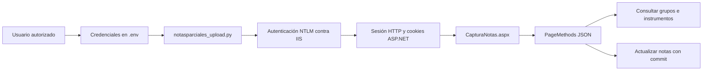
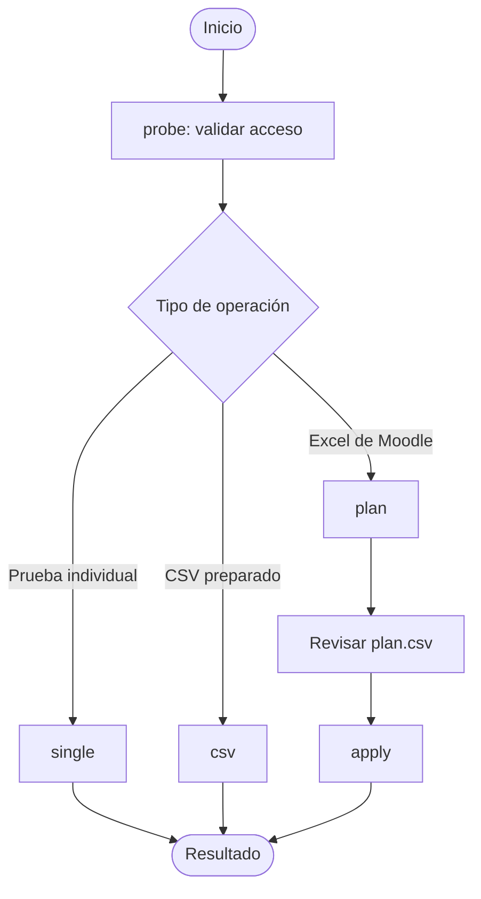
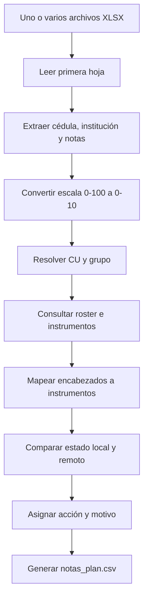
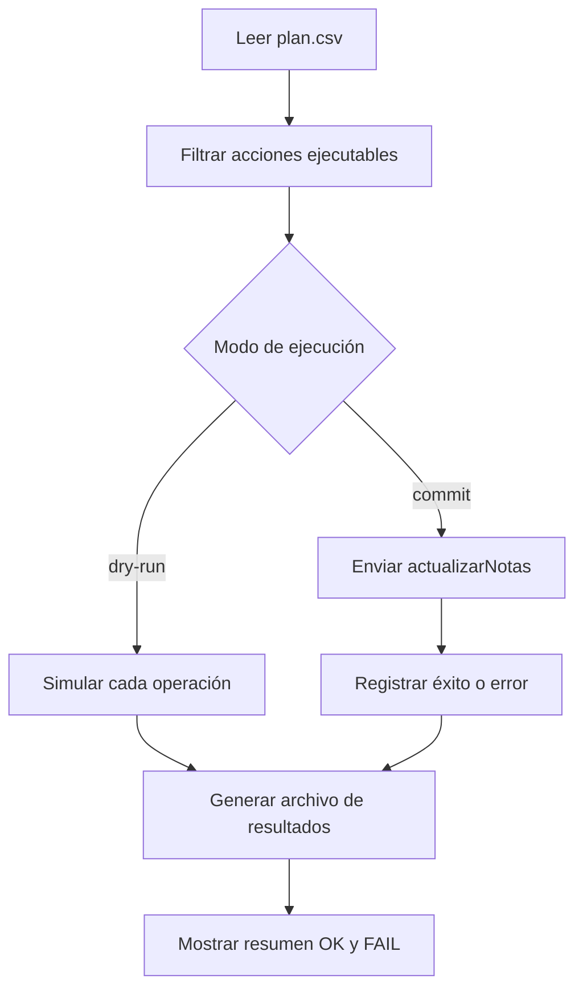
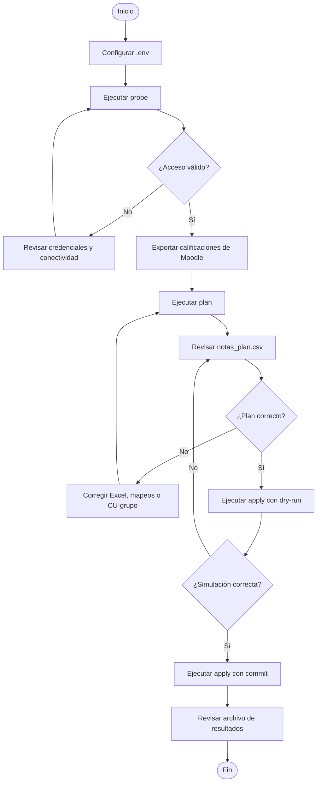
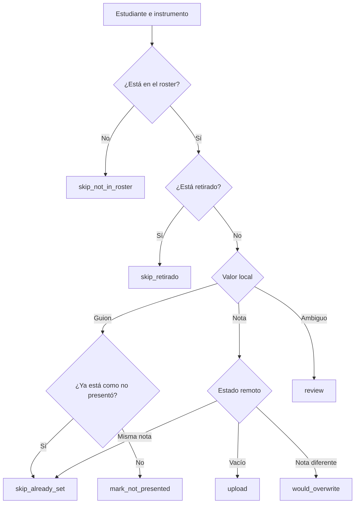
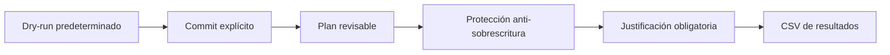

# Grade Uploader: Notas Parciales UNED

Herramienta de línea de comandos para consultar y cargar calificaciones en el sistema oficial de **Notas Parciales de la UNED**. Trabaja con los PageMethods JSON de `CapturaNotas.aspx`, procesa exportaciones Excel de Moodle y utiliza un flujo seguro, revisable y auditable.

> **Seguridad predeterminada:** el programa no modifica el servidor a menos que se indique `--commit` explícitamente.

## Tabla de contenidos

- [Características](#características)
- [Arquitectura y autenticación](#arquitectura-y-autenticación)
- [Requisitos e instalación](#requisitos-e-instalación)
- [Configuración](#configuración)
- [Sintaxis general](#sintaxis-general)
- [Modos de operación](#modos-de-operación)
- [Flujo recomendado](#flujo-recomendado)
- [Acciones del plan](#acciones-del-plan)
- [Controles de seguridad](#controles-de-seguridad)
- [Solución de problemas](#solución-de-problemas)

## Características

- Autenticación NTLM mediante credenciales almacenadas en `.env`.
- Creación automática de la sesión ASP.NET después del inicio de sesión.
- Verificación del acceso y descubrimiento de instrumentos con `probe`.
- Carga individual con `single` y carga por lotes desde CSV con `csv`.
- Lectura de uno o varios archivos `.xlsx` exportados desde Moodle.
- Conversión automática de notas desde escala 0-100 a escala 0-10.
- Comparación de las calificaciones locales contra el estado del servidor.
- Generación de un `plan.csv` auditable antes de escribir.
- Tratamiento de `-` como **no presentó**.
- Protección contra sobrescrituras, retiros y estudiantes fuera del grupo.
- Archivo de resultados después de ejecutar un plan.

## Arquitectura y autenticación

El sistema utiliza autenticación NTLM contra IIS. El cliente conserva la misma sesión HTTP durante el proceso y obtiene automáticamente las cookies ASP.NET requeridas por la aplicación.



La versión actual **no requiere copiar manualmente cookies del navegador**.

## Requisitos e instalación

### Requisitos

- Python 3.10 o superior.
- Cuenta UNED autorizada para ingresar a Notas Parciales.
- Acceso de red a `https://produccion.uned.ac.cr`.
- Dependencias: `requests`, `requests-ntlm`, `python-dotenv` y `openpyxl`.

### Instalación

```bash
git clone <URL_DEL_REPOSITORIO>
cd <CARPETA_DEL_REPOSITORIO>
python -m venv .venv
```

En Windows:

```bat
.venv\Scripts\activate
pip install -r requirements.txt
copy .env.example .env
```

En Linux o macOS:

```bash
source .venv/bin/activate
pip install -r requirements.txt
cp .env.example .env
```

Si no existe `requirements.txt`:

```bash
pip install requests requests-ntlm python-dotenv openpyxl
```

## Configuración

Cree un archivo `.env` en la carpeta del proyecto:

```dotenv
NP_NTLM_USER=usuario_uned
NP_NTLM_PASSWORD=contraseña

# Opcionales
NP_USUARIO_CEDULA=0000000000
NP_USUARIO_ROLE=14
```

Asegúrese de que `.gitignore` contenga:

```gitignore
.env
.venv/
__pycache__/
*.pyc
build/
dist/
*.spec
```

## Sintaxis general

Los parámetros globales se colocan **antes del subcomando**:

```bash
python notasparciales_upload.py [opciones_globales] <modo> [opciones_del_modo]
```

### Opciones globales

| Parámetro | Descripción |
|---|---|
| `-v`, `--verbose` | Información adicional. Use `-vv` para depuración. |
| `--dry-run` | Simula sin actualizar notas. |
| `--commit` | Habilita la escritura real. |
| `--allow-update` | Permite modificar una nota existente. |
| `--justificacion-codigo` | Código obligatorio al sobrescribir. |
| `--justificacion-texto` | Explicación adicional de la modificación. |
| `--delay` | Espera entre solicitudes. Predeterminado: `0.5` segundos. |

Si no se indica `--commit`, el programa utiliza `dry-run` automáticamente.

### Parámetros del contexto académico

| Parámetro | Descripción | Ejemplo |
|---|---|---|
| `--ano` | Año académico | `2026` |
| `--pac` | Período académico | `3` |
| `--tipo` | Tipo de matrícula. Predeterminado: `O` | `O` |
| `--escuela` | Código de escuela | `03` |
| `--catedra` | ID numérico de la cátedra | `253` |
| `--encargado` | Usuario del encargado | `ARODRIGUEZP` |
| `--tutor` | Cédula del tutor | `0401780367` |
| `--asignatura` | Código de asignatura | `00883` |
| `--modelo` | Modelo de evaluación | `4` |
| `--usuario-cedula` | Cédula del funcionario, opcional | `0401780367` |
| `--usuario-role` | Rol del usuario. Predeterminado: `14` | `14` |

`probe`, `single` y `csv` también requieren `--cu` y `--grupo`. En `plan` y `apply`, esos valores se determinan por fila.

## Modos de operación



### 1. `probe`

Verifica la autenticación, valida la sesión, consulta instrumentos y carga un resumen del grupo.

```bash
python notasparciales_upload.py -v probe \
  --ano 2026 --pac 3 --tipo O \
  --escuela 03 --catedra 253 \
  --encargado ARODRIGUEZP --tutor 0401780367 \
  --asignatura 00883 --cu 42 --grupo 1 --modelo 4
```

### 2. `single`

Carga o simula una nota individual en escala 0-10.

```bash
python notasparciales_upload.py --dry-run single \
  --ano 2026 --pac 3 --tipo O \
  --escuela 03 --catedra 253 \
  --encargado ARODRIGUEZP --tutor 0401780367 \
  --asignatura 00883 --cu 42 --grupo 1 --modelo 4 \
  --cedula 0117540192 --instrumento Tar1 --nota 8.9
```

### 3. `csv`

Formato mínimo del archivo:

```csv
cedula,instrumento,nota
0117540192,Tar1,8.9
0304560789,Tar1,7.5
0501230456,Proy1,8.0
```

Las notas deben estar en escala 0-10.

```bash
python notasparciales_upload.py --dry-run csv \
  --ano 2026 --pac 3 --tipo O \
  --escuela 03 --catedra 253 \
  --encargado ARODRIGUEZP --tutor 0401780367 \
  --asignatura 00883 --cu 42 --grupo 1 --modelo 4 \
  --upload-csv notas.csv
```

### 4. `plan`

Procesa uno o varios Excel de Moodle, consulta los grupos oficiales y produce un plan auditable.



Ejemplo:

```bash
python notasparciales_upload.py -v plan \
  --ano 2026 --pac 3 --tipo O \
  --escuela 03 --catedra 253 \
  --encargado ARODRIGUEZP --tutor 0401780367 \
  --asignatura 00883 --modelo 4 \
  --xlsx calificaciones_grupo_1.xlsx \
  --xlsx calificaciones_grupo_2.xlsx \
  --cu-grupo 42=1 \
  --cu-grupo 01=2 \
  --output notas_plan.csv
```

El Excel debe contener columnas como `Nombre`, `Apellido(s)`, `Número de ID`, `Institución` y columnas de nota identificadas por `(Real)` o `(Porcentaje)`.

El programa:

- extrae el CU desde valores como `SAN JOSE (01)`;
- convierte `89` en `8.9`;
- interpreta `-` como **no presentó**;
- ignora duplicados del mismo estudiante e instrumento entre archivos;
- compara los datos contra el roster y las notas existentes.

Para forzar el mapeo de una columna:

```bash
--map "Tarea: Entrega Actividad Proyecto Final (Real)=Proy1"
```

### 5. `apply`

Ejecuta las acciones permitidas de un plan previamente revisado.



Primero simule:

```bash
python notasparciales_upload.py --dry-run apply \
  --ano 2026 --pac 3 --tipo O \
  --escuela 03 --catedra 253 \
  --encargado ARODRIGUEZP --tutor 0401780367 \
  --asignatura 00883 --modelo 4 \
  --plan notas_plan.csv
```

Después, si el resultado es correcto:

```bash
python notasparciales_upload.py --commit apply \
  --ano 2026 --pac 3 --tipo O \
  --escuela 03 --catedra 253 \
  --encargado ARODRIGUEZP --tutor 0401780367 \
  --asignatura 00883 --modelo 4 \
  --plan notas_plan.csv
```

Para omitir `mark_not_presented`:

```bash
python notasparciales_upload.py --commit apply <contexto> \
  --plan notas_plan.csv --no-mark-not-presented
```

Para ejecutar `would_overwrite`:

```bash
python notasparciales_upload.py \
  --commit \
  --allow-update \
  --justificacion-codigo 2005 \
  --justificacion-texto "Corrección por error de digitación" \
  apply <contexto> --plan notas_plan.csv
```

## Flujo recomendado



## Acciones del plan



| Acción | Significado | ¿Se ejecuta? |
|---|---|---|
| `upload` | Nota nueva pendiente. | Sí |
| `mark_not_presented` | Marcar como no presentó. | Sí, salvo `--no-mark-not-presented`. |
| `would_overwrite` | Cambiaría una nota existente. | Solo con `--allow-update` y justificación. |
| `skip_already_set` | El servidor ya tiene el mismo estado. | No |
| `skip_retirado` | Estudiante con retiro. | No |
| `skip_not_in_roster` | Cédula fuera del grupo oficial. | No |
| `review` | Caso ambiguo. | No |

### Valores especiales del servidor

| Código | Significado |
|---:|---|
| `999` | Sin nota cargada |
| `998` | No presentó o no entregó |
| `994` | Retiro justificado |

## Controles de seguridad



1. No existe escritura real sin `--commit`.
2. Las diferencias se almacenan en un plan antes de aplicarse.
3. Una nota existente no cambia sin `--allow-update`.
4. `--allow-update` requiere `--justificacion-codigo`.
5. La sesión se valida al iniciar cada modo.
6. `apply` registra el resultado de cada fila.
7. `--delay` controla la pausa entre solicitudes.

## Archivo de resultados

Después de `apply`, se genera un archivo junto al plan:

```text
notas_plan.csv
notas_plan_resultados.csv
```

Cada fila incluye `resultado=ok`, `resultado=dry_run` o el detalle del fallo. El programa continúa con las filas restantes y devuelve código de salida `1` si se produjo al menos un error.

## Solución de problemas

### Faltan credenciales NTLM

Verifique `NP_NTLM_USER` y `NP_NTLM_PASSWORD` en `.env`.

### Falta una dependencia

```bash
pip install requests-ntlm openpyxl python-dotenv requests
```

### No se pudo validar la sesión

Revise las credenciales, la conectividad y ejecute `probe` con `-vv`.

### Columna sin mapeo

Ejecute `probe` para identificar códigos válidos y utilice:

```bash
--map "ENCABEZADO EXACTO=CODIGO"
```

### Cédula no encontrada

Compruebe `Número de ID` en Moodle y el mapeo `--cu-grupo`.

### El plan muestra `would_overwrite`

Revise `nota_local` y `nota_remota`. Si el cambio es legítimo, use `--allow-update` con una justificación válida.

### Depuración

```bash
python notasparciales_upload.py -vv probe <contexto>
```

Los registros de depuración pueden contener información técnica sensible. Revíselos antes de compartirlos.

## Recomendaciones operativas

- Ejecute `probe` antes de cada carga.
- Conserve el `plan.csv` revisado como evidencia.
- Ejecute siempre `apply --dry-run` antes de `apply --commit`.
- Revise especialmente `would_overwrite`, `review` y `skip_not_in_roster`.
- Archive juntos el plan y su archivo de resultados.
- No comparta `.env`, credenciales ni registros sin depurarlos.

## Licencia

Consulte el archivo `LICENSE` incluido en el repositorio.
