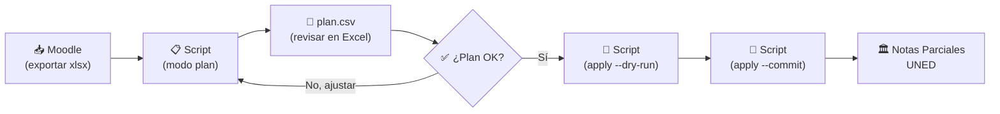
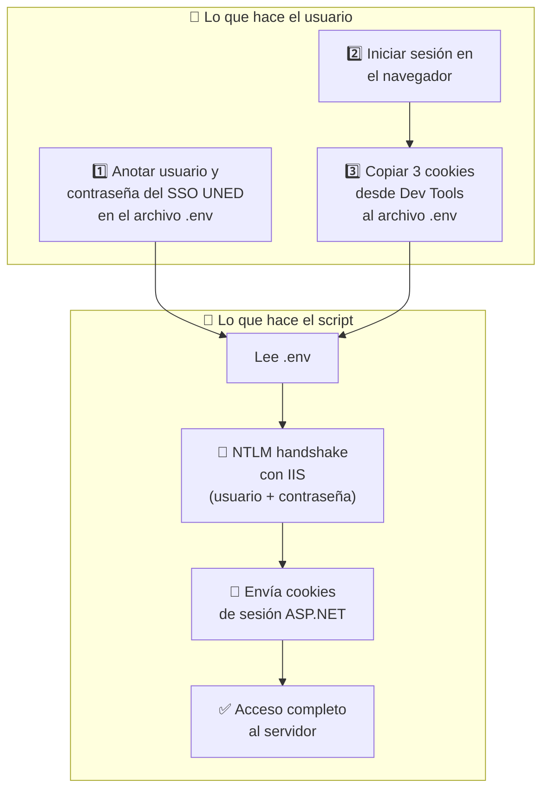
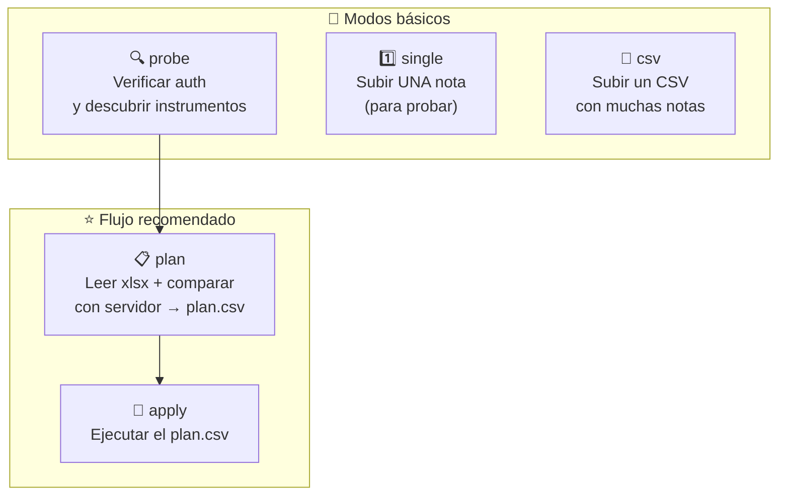
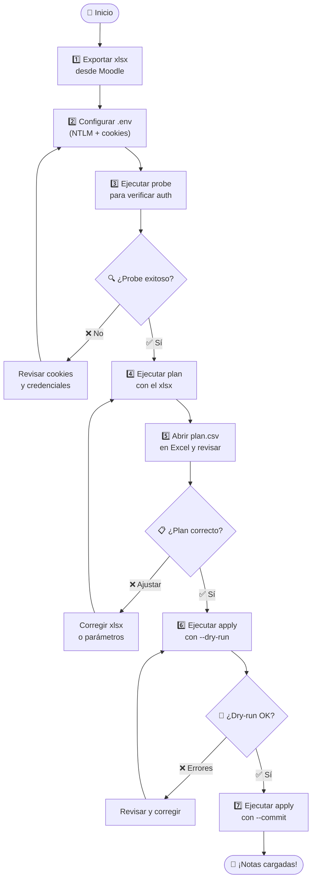
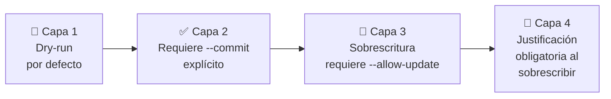

# 📊 Grade Uploader — Notas Parciales UNED

> **Automatiza la subida de notas al sistema oficial de [Captura de Notas Parciales](https://produccion.uned.ac.cr/notasparciales/Formularios/CapturaNotas.aspx) de la UNED Costa Rica.**

En lugar de cargar notas una por una en el navegador, este script lee las calificaciones desde un archivo Excel exportado de Moodle (o un CSV manual) y las sube al sistema de Notas Parciales de forma masiva, segura y auditable.

---

## 📑 Tabla de contenidos

- [🔭 Vista general](#-vista-general)
- [⚙️ Requisitos previos](#️-requisitos-previos)
- [🚀 Instalación](#-instalación)
- [🔑 Configuración de credenciales](#-configuración-de-credenciales)
- [🍪 Cómo obtener las cookies del navegador](#-cómo-obtener-las-cookies-del-navegador)
- [📊 Formato de archivos de entrada](#-formato-de-archivos-de-entrada)
- [🛠️ Modos de uso](#️-modos-de-uso)
- [✅ Flujo recomendado paso a paso](#-flujo-recomendado-paso-a-paso)
- [📖 Referencia de parámetros CLI](#-referencia-de-parámetros-cli)
- [🔒 Seguridad](#-seguridad)
- [🩺 Solución de problemas](#-solución-de-problemas)
- [🛡️ Seguridad de secretos y `.gitignore`](#️-seguridad-de-secretos-y-el-archivo-gitignore)
- [📜 Licencia](#-licencia)

---

## 🔭 Vista general

El sistema de **Notas Parciales** de la UNED (`produccion.uned.ac.cr/notasparciales`) es una aplicación web ASP.NET donde los tutores capturan las calificaciones oficiales de cada instrumento de evaluación (tareas, proyectos, exámenes, etc.).

Este script **replica las mismas llamadas HTTP que hace el navegador**, pero automatizadas desde la línea de comandos. Esto permite:

- ✅ Subir **decenas o cientos de notas** en segundos en lugar de minutos.
- ✅ **Comparar** las notas de Moodle contra las que ya están en el sistema antes de escribir nada.
- ✅ Generar un **plan auditable** (CSV) que se puede revisar en Excel antes de confirmar.
- ✅ Modo **dry-run** por defecto: nada se escribe hasta que se confirme explícitamente.

### 🗺️ Flujo general



### 🔐 Arquitectura de autenticación

El sistema de Notas Parciales usa **dos capas de autenticación** apiladas. Ambas son necesarias:



| Capa | ¿Qué es? | ¿De dónde sale? |
|------|----------|----------------|
| 🔑 **NTLM** | Autenticación Windows a nivel del servidor IIS | Tu usuario y contraseña del SSO UNED (el mismo de `entornofuncionarios.uned.ac.cr`) |
| 🍪 **Cookies de sesión** | Pase temporal que el navegador recibe al iniciar sesión | Se copian desde las herramientas de desarrollador del navegador |

---

## ⚙️ Requisitos previos

| Requisito | Detalle |
|-----------|--------|
| 💻 **Sistema operativo** | Windows 10 o Windows 11 |
| 🐍 **Python 3.10+** | Solo si NO vas a usar el ejecutable `.exe` |
| 🌐 **Cuenta SSO UNED** | Con acceso al sistema de Notas Parciales |
| 📶 **Conexión a internet** | Para comunicarse con el servidor de la UNED |

> [!TIP]
> Si no tenés Python instalado y no querés instalarlo, podés generar un **ejecutable `.exe`** que incluye todo lo necesario. Vea la sección [🚀 Instalación — Opción B](#opción-b--ejecutable-exe-sin-python).

---

## 🚀 Instalación

### Opción A — 🏃 Instalación automática (recomendada)

1️⃣ Descargá o cloná este repositorio:

```bash
git clone https://github.com/chhdeza/grade-uploader.git
cd grade-uploader
```

2️⃣ Ejecutá el instalador:

```
instalar.bat
```

Esto automáticamente:
- ✅ Verifica que Python esté instalado
- ✅ Crea un entorno virtual (`.venv`)
- ✅ Instala las dependencias
- ✅ Crea el archivo `.env` desde la plantilla

3️⃣ Configurá las credenciales en el archivo `.env` (ver [🔑 Configuración de credenciales](#-configuración-de-credenciales)).

---

### Opción B — 📦 Ejecutable `.exe` (sin Python)

Si no tenés Python instalado (o preferís no instalarlo), podés generar un ejecutable independiente.

**Para generar el `.exe`:** (requiere Python solo una vez, en cualquier computadora)

```
construir_exe.bat
```

Esto genera `notasparciales_upload.exe` en la carpeta raíz. Después:

1️⃣ Copiá estos 2 archivos a cualquier computadora con Windows:
   - `notasparciales_upload.exe`
   - `.env` (con las credenciales ya configuradas)

2️⃣ Ejecutá desde la línea de comandos:

```
notasparciales_upload.exe probe --ano 2026 --pac 3 ...
```

> [!NOTE]
> El `.exe` pesa aproximadamente 15-25 MB porque incluye Python y todas las dependencias empaquetadas.

---

### Opción C — 🔧 Instalación manual

```bash
# Crear entorno virtual
python -m venv .venv

# Activar el entorno virtual
.venv\Scripts\activate

# Instalar dependencias
pip install -r requirements.txt

# Crear archivo de configuración
copy .env.example .env
```

---

## 🔑 Configuración de credenciales

Toda la configuración se guarda en un archivo llamado **`.env`** en la misma carpeta del script. Este archivo **nunca se sube al repositorio** (está en `.gitignore`).

Abrí el archivo `.env` con cualquier editor de texto (Bloc de notas, VS Code, Notepad++, etc.) y completá los valores:

### Parte 1 — 🔑 Credenciales NTLM (fácil)

Son el **mismo usuario y contraseña** que usás para entrar al [Entorno de Funcionarios UNED](https://entornofuncionarios.uned.ac.cr/).

```ini
# Tu usuario del SSO UNED (sin @uned.ac.cr)
# Ejemplo: si tu correo es jperez@uned.ac.cr, tu usuario es "jperez"
NP_NTLM_USER=jperez

# Tu contraseña del SSO UNED (la misma del correo institucional)
NP_NTLM_PASSWORD=tu_contraseña_aqui
```

> [!IMPORTANT]
> El usuario es **solo el nombre**, sin `@uned.ac.cr`. Por ejemplo: `jperez`, NO `jperez@uned.ac.cr`.

### Parte 2 — 🍪 Cookies de sesión (requiere Dev Tools)

Las cookies son como un **pase temporal** que el navegador recibe al iniciar sesión en Notas Parciales. El script necesita ese pase para poder comunicarse con el servidor.

```ini
NP_COOKIE_ASPNET_SESSIONID=abc123xyz...
NP_COOKIE_UZMX=A2B3C4D5E6...
NP_COOKIE_UZMXJ=F7G8H9I0J1...
```

> [!WARNING]
> ⏱️ Las cookies **expiran después de ~20 minutos de inactividad**. Si el script empieza a fallar, hay que volver al navegador, recargar la página y copiar cookies nuevas. Vea la sección siguiente para instrucciones detalladas.

📌 **¿De dónde salen estos valores?** Vea la siguiente sección: [🍪 Cómo obtener las cookies del navegador](#-cómo-obtener-las-cookies-del-navegador).

---

## 🍪 Cómo obtener las cookies del navegador

Esta es la parte que requiere un poco más de atención. Seguí los pasos exactos para tu navegador y todo saldrá bien. 🙂

### 0️⃣ Paso previo (igual para todos los navegadores)

Antes de copiar las cookies, asegurate de que la sesión esté activa:

1. Abrí tu navegador favorito (Chrome, Edge o Firefox).
2. Navegá a: **https://produccion.uned.ac.cr/notasparciales/Formularios/CapturaNotas.aspx**
3. Iniciá sesión normalmente con tus credenciales UNED.
4. **Verificá que la página cargó correctamente:** debés ver los dropdowns de Año, PAC, Escuela, etc. Si ves una pantalla de login o una página en blanco, recargá con F5.

> [!TIP]
> 💡 Mantené esta pestaña del navegador **abierta** mientras usás el script. Así las cookies no expiran tan rápido.

---

### 🌐 Google Chrome (Windows)

<details open>
<summary><strong>🖱️ Click para ver las instrucciones paso a paso</strong></summary>

**1️⃣ Abrir las Herramientas de Desarrollador**

- Presioná la tecla **`F12`** en tu teclado
  - *Alternativa:* click derecho en cualquier parte de la página → **"Inspeccionar"**
- Se abrirá un panel en la parte inferior o lateral de la ventana

**2️⃣ Ir a la pestaña "Application"**

- En la barra superior del panel de DevTools, buscá la pestaña que dice **"Application"**
- Si no la ves, hacé click en el botón **`>>`** (doble flecha) para ver las pestañas ocultas

```
┌─────────────────────────────────────────────────────────────┐
│ Elements  Console  Sources  Network  ▶▶  Application  ...  │
│                                           ^^^^^^^^^^^       │
│                                           ESTA PESTAÑA     │
└─────────────────────────────────────────────────────────────┘
```

**3️⃣ Navegar a Cookies**

- En el **panel izquierdo**, buscá la sección **"Storage"** (Almacenamiento)
- Expandí **"Cookies"** haciendo click en el triángulo ▶
- Hacé click en **`https://produccion.uned.ac.cr`**

```
┌──────────────────────────┬──────────────────────────────────┐
│ Storage                  │  Name              │ Value       │
│  ▼ Cookies               │  ASP.NET_SessionId │ abc123...   │ ← 📋 Copiar
│    ► produccion.uned...  │  uzmx              │ A2B3C4...   │ ← 📋 Copiar
│                          │  uzmxj             │ F7G8H9...   │ ← 📋 Copiar
└──────────────────────────┴──────────────────────────────────┘
```

**4️⃣ Copiar cada valor**

Para cada una de las 3 cookies (`ASP.NET_SessionId`, `uzmx`, `uzmxj`):

1. 🖱️ Hacé **doble click** sobre el texto en la columna **"Value"**
2. El texto se seleccionará automáticamente
3. Presioná **`Ctrl + C`** para copiar
4. Abrí tu archivo `.env` y pegá el valor con **`Ctrl + V`**

Resultado en tu archivo `.env`:
```ini
NP_COOKIE_ASPNET_SESSIONID=abc123xyz789...
NP_COOKIE_UZMX=A2B3C4D5E6F7...
NP_COOKIE_UZMXJ=F7G8H9I0J1K2...
```

</details>

---

### 🔵 Microsoft Edge (Windows)

<details>
<summary><strong>🖱️ Click para ver las instrucciones paso a paso</strong></summary>

> 💡 Edge usa el mismo motor que Chrome, así que los pasos son **prácticamente idénticos**.

**1️⃣ Abrir las Herramientas de Desarrollador**

- Presioná **`F12`**
  - *Alternativa:* click derecho → **"Inspeccionar"**
  - *Alternativa:* menú `···` (arriba a la derecha) → "Más herramientas" → "Herramientas de desarrollo"

**2️⃣ Ir a la pestaña "Aplicación"**

- En la barra superior de DevTools, buscá **"Aplicación"** (puede aparecer en español si Edge está en español)
- Si no la ves, hacé click en **`>>`** para ver pestañas ocultas
- En inglés se llama **"Application"**

**3️⃣ Navegar a Cookies**

- Panel izquierdo → **"Almacenamiento"** (o "Storage") → **"Cookies"** → click en **`https://produccion.uned.ac.cr`**

**4️⃣ Copiar cada valor**

- Igual que en Chrome: **doble click** en la columna "Value" → **`Ctrl + C`** → pegar en `.env`

Buscá las mismas 3 cookies:
| Cookie | Variable en `.env` |
|--------|-------------------|
| `ASP.NET_SessionId` | `NP_COOKIE_ASPNET_SESSIONID` |
| `uzmx` | `NP_COOKIE_UZMX` |
| `uzmxj` | `NP_COOKIE_UZMXJ` |

</details>

---

### 🦊 Mozilla Firefox (Windows)

<details>
<summary><strong>🖱️ Click para ver las instrucciones paso a paso</strong></summary>

**1️⃣ Abrir las Herramientas de Desarrollador**

- Presioná **`F12`**
  - *Alternativa:* click derecho → **"Inspeccionar"**
  - *Alternativa:* menú ☰ → "Más herramientas" → "Herramientas para desarrolladores web"

**2️⃣ Ir a la pestaña "Almacenamiento"**

- En Firefox la pestaña se llama **"Almacenamiento"** (o **"Storage"** si está en inglés)
- ⚠️ **No confundir** con "Red" ni con "Consola" — es **"Almacenamiento"**

```
┌────────────────────────────────────────────────────────────────┐
│ Inspector  Consola  Depurador  Red  Almacenamiento  ...       │
│                                     ^^^^^^^^^^^^^^             │
│                                     ESTA PESTAÑA              │
└────────────────────────────────────────────────────────────────┘
```

**3️⃣ Navegar a Cookies**

- En el panel izquierdo, expandí **"Cookies"**
- Hacé click en **`https://produccion.uned.ac.cr`**

```
┌──────────────────────────┬──────────────────────────────────┐
│ Almacenamiento           │  Nombre             │ Valor      │
│  ▼ Cookies               │  ASP.NET_SessionId  │ abc123...  │ ← 📋
│    ► produccion.uned...  │  uzmx               │ A2B3C4...  │ ← 📋
│                          │  uzmxj              │ F7G8H9...  │ ← 📋
└──────────────────────────┴──────────────────────────────────┘
```

**4️⃣ Copiar cada valor**

1. 🖱️ Hacé **doble click** sobre el valor de la cookie
2. Se abrirá un campo de edición con el texto seleccionado
3. Presioná **`Ctrl + C`** para copiar
4. Pegá en tu archivo `.env` con **`Ctrl + V`**

</details>

---

### ⚡ Resumen rápido (para usuarios experimentados)

| Navegador | Atajo | Ruta al panel de cookies |
|-----------|-------|-------------------------|
| 🌐 Chrome | `F12` | Application → Storage → Cookies → `produccion.uned.ac.cr` |
| 🔵 Edge | `F12` | Aplicación → Almacenamiento → Cookies → `produccion.uned.ac.cr` |
| 🦊 Firefox | `F12` | Almacenamiento → Cookies → `produccion.uned.ac.cr` |

**Cookies a copiar:**

| Cookie en el navegador | Variable en `.env` |
|------------------------|-----------|
| `ASP.NET_SessionId` | `NP_COOKIE_ASPNET_SESSIONID` |
| `uzmx` | `NP_COOKIE_UZMX` |
| `uzmxj` | `NP_COOKIE_UZMXJ` |

---

### 🔄 ¿Qué hacer cuando las cookies expiran?

Las cookies expiran tras **~20 minutos de inactividad** en el navegador.

**🚨 Síntomas de cookies expiradas:**
- El script muestra: `"respuesta no-JSON (Content-Type=...)"` 
- O muestra: `"Probable expiración de cookies. Rfrescá las 3 cookies en .env"`

**✅ Solución (30 segundos):**

1. Volvé al navegador donde tenés abierta la página de Notas Parciales
2. Presioná **`F5`** para recargar la página
3. Esperá a que cargue completamente
4. Repetí el proceso de copiar las 3 cookies (los valores cambiaron)
5. Pegá los nuevos valores en `.env`
6. Guardá `.env` y volvé a ejecutar el script

> [!TIP]
> 💡 **Truco para que duren más:** mantené la pestaña del navegador abierta y recargá la página (F5) **justo antes** de ejecutar el script. Así obtenés cookies frescas cada vez.

---

## 📊 Formato de archivos de entrada

### 📗 Archivos Excel de Moodle (`.xlsx`) — para modo `plan`

El modo `plan` lee archivos Excel exportados directamente desde Moodle. Así se exportan:

**📥 Cómo exportar el xlsx desde Moodle:**

1️⃣ Entrá a tu curso en Moodle

2️⃣ En el menú de navegación, andá a **Calificaciones**
   - Ruta: *Administración del curso* → *Calificaciones*

3️⃣ En la página de calificaciones, buscá el menú/pestaña **"Exportar"**

4️⃣ Seleccioná **"Hoja de cálculo Excel"**

5️⃣ Seleccioná las actividades que querés exportar y hacé click en **"Descargar"**

**📋 Columnas obligatorias en el xlsx:**

El archivo exportado debe tener estas columnas (Moodle las genera automáticamente):

| Columna | Ejemplo | Descripción |
|---------|---------|-------------|
| `Nombre` | María | Nombre del estudiante |
| `Apellido(s)` | Pérez Solano | Apellidos |
| `Número de ID` | 0117540192 | **Cédula del estudiante** (debe coincidir con Notas Parciales) |
| `Institución` | SAN JOSE (01) | Centro universitario. El número entre paréntesis es el código CU |

**📊 Columnas de notas:**

El script detecta automáticamente las columnas que terminan en `(Real)` o `(Porcentaje)`. Estas son las columnas de calificación que Moodle genera por cada actividad.

**📌 Ejemplo de cómo luce un xlsx exportado:**

| Nombre | Apellido(s) | Número de ID | Institución | Tarea 1 (Real) | Proyecto Final (Real) |
|--------|-------------|-------------|-------------|-----------------|----------------------|
| María | Pérez Solano | 0117540192 | SAN JOSE (01) | 89 | 95 |
| Juan | Rodríguez Li | 0304560789 | DESAMPARADOS (42) | 75 | - |
| Ana | Mora Castro | 0501230456 | SAN JOSE (01) | - | 80 |

> [!IMPORTANT]
> 📌 **Sobre la columna "Número de ID":** este valor **debe ser la cédula del estudiante** y debe coincidir con la que aparece en Notas Parciales. Si en Moodle no está configurado (aparece vacío), el script no podrá mapear a ese estudiante.

> [!NOTE]
> 📌 **Sobre la columna "Institución":** el script extrae el código numérico entre paréntesis (ej: `01` de `SAN JOSE (01)`) para determinar a qué centro universitario pertenece cada estudiante. Esto se combina con el parámetro `--cu-grupo` para saber a qué grupo del sistema pertenece.

**📐 Escala de notas: Moodle (0–100) vs Notas Parciales (0–10)**

```
Moodle:           0 ────────────────────── 100
                  │                          │
                  │    ÷ 10 (automático)     │
                  │                          │
Notas Parciales:  0 ──────────── 10
```

El modo `plan` convierte automáticamente dividiendo entre 10. Por ejemplo: `89` en Moodle → `8.9` en Notas Parciales.

**🔤 Valor especial `-` (guion):**

Si una celda de nota tiene un **guion (`-`)**, el script lo interpreta como **"no presentó el instrumento"** y lo marca con el código 998 en el sistema de Notas Parciales.

---

### 📄 Archivos CSV — para modo `csv`

El modo `csv` usa un archivo CSV simple con las notas **ya en escala 0–10**.

**Formato:**

```csv
cedula,instrumento,nota
0117540192,Tar1,8.9
0304560789,Tar1,7.5
0501230456,Proy1,8.0
```

Columnas opcionales adicionales: `observacion_codigo`, `justificacion`.

> [!WARNING]
> ⚠️ **Diferencia importante:** el modo `csv` espera notas **ya en escala 0–10** (el formato de Notas Parciales). NO hace conversión automática como el modo `plan`. Si tus notas vienen de Moodle en escala 0–100, dividí entre 10 antes de crear el CSV.

---

## 🛠️ Modos de uso

El script tiene 5 modos de operación. Los más comunes para carga masiva son **`plan`** + **`apply`**.



---

### 🔍 Modo `probe` — Verificar conexión

Verifica que tus credenciales funcionan y muestra los instrumentos de evaluación del modelo.

```bash
python notasparciales_upload.py probe \
    --ano 2026 --pac 3 --tipo O \
    --escuela 03 --catedra 253 \
    --encargado ARODRIGUEZP --tutor 0401780367 \
    --asignatura 00883 --cu 42 --grupo 1 --modelo 4
```

**🖥️ Salida esperada:**
```
== Probando autenticación ==
OK: cookies válidas, el sistema está abierto.

== Nota mínima para 00883 ==
Nota mínima de aprobación: 7

== Instrumentos del modelo ==
Mapeo Codigo -> Nombre del instrumento:
  Tar1     ->  Tarea 1 (2)
  Tar2     ->  Tarea 2 (2)
  Tar3     ->  Tarea 3 (2)
  Proy1    ->  Proyecto 1 (4)

== Cargando tabla del grupo (resumen) ==
Estudiantes en el grupo: 25
```

> [!TIP]
> 💡 **Siempre empezá con `probe`** para confirmar que las cookies y credenciales funcionan antes de hacer cualquier otra operación.

---

### 1️⃣ Modo `single` — Subir una nota individual

Ideal para **probar** que todo funciona antes de hacer una carga masiva.

```bash
# Primero con --dry-run (NO escribe nada):
python notasparciales_upload.py single \
    --ano 2026 --pac 3 --tipo O \
    --escuela 03 --catedra 253 \
    --encargado ARODRIGUEZP --tutor 0401780367 \
    --asignatura 00883 --cu 42 --grupo 1 --modelo 4 \
    --cedula 0117540192 --instrumento Tar1 --nota 8.9 \
    --dry-run
```

Si todo se ve bien, ejecutá **sin `--dry-run`** (agregando `--commit`):

```bash
python notasparciales_upload.py single \
    ... --commit
```

---

### 📄 Modo `csv` — Subir un CSV con muchas notas

```bash
python notasparciales_upload.py csv \
    --ano 2026 --pac 3 --tipo O \
    --escuela 03 --catedra 253 \
    --encargado ARODRIGUEZP --tutor 0401780367 \
    --asignatura 00883 --cu 42 --grupo 1 --modelo 4 \
    --upload-csv notas.csv \
    --dry-run
```

---

### 📋 Modo `plan` — ⭐ Generar plan desde xlsx de Moodle

Este es el modo **recomendado** para cargas masivas. Lee el xlsx exportado de Moodle, consulta el estado actual del servidor, y genera un `plan.csv` que podés revisar antes de ejecutar.

```bash
python notasparciales_upload.py plan \
    --ano 2026 --pac 3 --tipo O \
    --escuela 03 --catedra 253 \
    --encargado ARODRIGUEZP --tutor 0401780367 \
    --asignatura 00883 --modelo 4 \
    --xlsx calificaciones_moodle.xlsx \
    --cu-grupo 42=1 --cu-grupo 01=2 \
    --output notas_plan.csv
```

**¿Qué significa `--cu-grupo 42=1 --cu-grupo 01=2`?**

Mapea cada centro universitario (CU) al número de grupo en Notas Parciales:
- `42=1` → CU 42 (Desamparados) = Grupo 1
- `01=2` → CU 01 (San José) = Grupo 2

**📄 El plan.csv generado contiene:**

| Columna | Significado |
|---------|------------|
| `cedula` | Cédula del estudiante |
| `instrumento` | Código del instrumento (Tar1, Proy1, etc.) |
| `nota_local` | Nota calculada desde el xlsx (ya en escala 0-10) |
| `nota_remota` | Nota que actualmente tiene el servidor |
| `accion` | Qué va a hacer el script con esta fila |
| `motivo` | Explicación legible de la acción |

**Acciones posibles en el plan:**

| Acción | Significado | ¿Se ejecuta? |
|--------|------------|------------|
| ✅ `upload` | Nota pendiente de cargar | Sí |
| ⚠️ `mark_not_presented` | Marcar como "no presentó" | Sí (salvo `--no-mark-not-presented`) |
| 🔄 `would_overwrite` | Cambiaría una nota existente | Solo con `--allow-update` |
| ⏭️ `skip_already_set` | Ya tiene la misma nota | No (ya está bien) |
| 🚫 `skip_retirado` | Estudiante retirado (994) | No |
| ❓ `skip_not_in_roster` | No está en el grupo del servidor | No |
| 👀 `review` | Caso ambiguo, revisar manualmente | No |

> [!TIP]
> 💡 **Abrí el `plan.csv` en Excel** y revisá las columnas `accion` y `motivo` antes de ejecutar `apply`. Así podés verificar que todo tiene sentido.

---

### 🚀 Modo `apply` — ⭐ Ejecutar el plan

Ejecuta las acciones del `plan.csv` generado en el paso anterior.

```bash
# Primero SIEMPRE en dry-run:
python notasparciales_upload.py apply \
    --ano 2026 --pac 3 --tipo O \
    --escuela 03 --catedra 253 \
    --encargado ARODRIGUEZP --tutor 0401780367 \
    --asignatura 00883 --modelo 4 \
    --plan notas_plan.csv \
    --dry-run

# Cuando estés seguro, con --commit:
python notasparciales_upload.py apply \
    --ano 2026 --pac 3 --tipo O \
    --escuela 03 --catedra 253 \
    --encargado ARODRIGUEZP --tutor 0401780367 \
    --asignatura 00883 --modelo 4 \
    --plan notas_plan.csv \
    --commit
```

Al terminar, se genera un archivo `notas_plan_resultados.csv` con el estado de cada operación.

---

## ✅ Flujo recomendado paso a paso

Este es el proceso completo que recomendamos para subir notas de forma segura:



### Comandos resumidos

```bash
# 1. Verificar autenticación
python notasparciales_upload.py probe \
    --ano 2026 --pac 3 --tipo O \
    --escuela 03 --catedra 253 \
    --encargado ARODRIGUEZP --tutor 0401780367 \
    --asignatura 00883 --cu 42 --grupo 1 --modelo 4

# 2. Generar plan desde xlsx
python notasparciales_upload.py plan \
    --ano 2026 --pac 3 --tipo O \
    --escuela 03 --catedra 253 \
    --encargado ARODRIGUEZP --tutor 0401780367 \
    --asignatura 00883 --modelo 4 \
    --xlsx calificaciones_moodle.xlsx \
    --cu-grupo 42=1 --cu-grupo 01=2

# 3. Revisar notas_plan.csv en Excel...

# 4. Dry-run del plan
python notasparciales_upload.py apply \
    --ano 2026 --pac 3 --tipo O \
    --escuela 03 --catedra 253 \
    --encargado ARODRIGUEZP --tutor 0401780367 \
    --asignatura 00883 --modelo 4 \
    --plan notas_plan.csv --dry-run

# 5. Ejecutar de verdad
python notasparciales_upload.py apply \
    --ano 2026 --pac 3 --tipo O \
    --escuela 03 --catedra 253 \
    --encargado ARODRIGUEZP --tutor 0401780367 \
    --asignatura 00883 --modelo 4 \
    --plan notas_plan.csv --commit
```

---

## 📖 Referencia de parámetros CLI

### 🌐 Parámetros de contexto del curso

Estos parámetros identifican **exactamente** a qué grupo y modelo de evaluación van dirigidas las notas. Corresponden a los dropdowns visibles en la página web de Captura de Notas.

```
┌──────────────────────────────────────────────────────────────────┐
│                 Página de Captura de Notas                       │
│                                                                  │
│  Año: [2026 ▼]  ← --ano 2026                                    │
│  PAC: [3 ▼]     ← --pac 3                                       │
│  Tipo: [Ordinaria ▼] ← --tipo O                                 │
│                                                                  │
│  Escuela: [03 - Ciencias Exactas ▼]    ← --escuela 03           │
│  Cátedra: [253 - Informática ▼]       ← --catedra 253           │
│  Encargado: [ARODRIGUEZP ▼]           ← --encargado ARODRIGUEZP │
│  Tutor: [0401780367 ▼]                ← --tutor 0401780367      │
│                                                                  │
│  Asignatura: [00883 ▼]                ← --asignatura 00883      │
│  Centro Univ: [42 ▼]                  ← --cu 42                 │
│  Grupo: [1 ▼]                         ← --grupo 1               │
│  Modelo: [4 ▼]                        ← --modelo 4              │
└──────────────────────────────────────────────────────────────────┘
```

| Parámetro | Tipo | Requerido | Descripción | Ejemplo |
|-----------|------|-----------|-------------|--------|
| `--ano` | texto | ✅ | Año académico | `2026` |
| `--pac` | texto | ✅ | Período académico (cuatrimestre) | `3` |
| `--tipo` | texto | ❌ | Tipo de matrícula (default: `O` = Ordinaria) | `O` |
| `--escuela` | texto | ✅ | Código de escuela | `03` |
| `--catedra` | entero | ✅ | ID numérico de cátedra | `253` |
| `--encargado` | texto | ✅ | Username del encargado de cátedra | `ARODRIGUEZP` |
| `--tutor` | texto | ✅ | Cédula del tutor | `0401780367` |
| `--asignatura` | texto | ✅ | Sigla del curso | `00883` |
| `--cu` | texto | ✅* | Código del centro universitario | `42` |
| `--grupo` | entero | ✅* | Número de grupo | `1` |
| `--modelo` | entero | ✅ | Modelo de evaluación | `4` |

> *En los modos `plan` y `apply`, `--cu` y `--grupo` no son requeridos porque se infieren del xlsx y del parámetro `--cu-grupo`.

### 🔧 Parámetros de control

| Parámetro | Descripción |
|-----------|-------------|
| `--dry-run` | 🧪 **No escribe nada** al servidor (solo muestra qué haría). Activado por defecto. |
| `--commit` | 🚀 Confirma la escritura real. **Desactiva** `--dry-run`. |
| `--allow-update` | 🔄 Permite sobrescribir notas que ya existen en el sistema. |
| `--justificacion-codigo` | 📝 Código de justificación al sobrescribir (ej: `2005` = Error de digitación). |
| `--justificacion-texto` | 📝 Texto libre para la justificación. |
| `--delay` | ⏱️ Segundos entre requests (default: `0.5`). |
| `-v` | 📢 Verbose: muestra más detalle (`-v` = info, `-vv` = debug). |

### 📋 Parámetros específicos del modo `plan`

| Parámetro | Descripción |
|-----------|-------------|
| `--xlsx <ruta>` | Ruta al xlsx exportado de Moodle. Se puede repetir para varios archivos. |
| `--cu-grupo <CU=GRUPO>` | Mapeo CU → grupo. Repetible. Ej: `--cu-grupo 42=1 --cu-grupo 01=2` |
| `--map <COL=CODIGO>` | Mapeo manual de columna del xlsx a código de instrumento. Ej: `--map 'Tarea: Entrega Actividad Proyecto Final (Real)=Proy1'` |
| `--output <ruta>` | Ruta al CSV de salida (default: `notas_plan.csv`). |

### 🚀 Parámetros específicos del modo `apply`

| Parámetro | Descripción |
|-----------|-------------|
| `--plan <ruta>` | Ruta al `plan.csv` generado por el modo `plan`. |
| `--no-mark-not-presented` | No ejecutar las filas con acción `mark_not_presented`. |

---

## 🔒 Seguridad

El script está diseñado con **múltiples capas de protección** para evitar errores accidentales:



| Capa | Qué protege | Cómo funciona |
|------|-------------|----------|
| 🧪 **Dry-run** | Contra escrituras accidentales | Por defecto NO escribe nada. Hay que pasar `--commit` explícitamente. |
| 📋 **Plan auditable** | Contra notas incorrectas | El modo `plan` genera un CSV que podés revisar en Excel **antes** de ejecutar. |
| 🔄 **Protección anti-sobrescritura** | Contra borrar notas existentes | Si una nota ya existe, el script se niega a cambiarla. Requiere `--allow-update`. |
| 📝 **Justificación** | Trazabilidad | Si se sobrescribe una nota, se exige un código de justificación que queda registrado. |
| 🔍 **Verificación post-escritura** | Confirmar que se guardó bien | En modo `single`, el script re-lee la nota del servidor para confirmar. |

---

## 🩺 Solución de problemas

| # | 🚨 Síntoma | 💡 Causa probable | ✅ Solución |
|---|-----------|-------------------|-----------|
| 1 | `"respuesta no-JSON"` o `"Probable expiración de cookies"` | Las cookies expiraron (~20 min sin actividad) | Recargá la página en el navegador (F5), copiá las 3 cookies nuevamente al `.env` |
| 2 | `HTTP 401` o `"WWW-Authenticate: Negotiate"` | Credenciales NTLM incorrectas o faltantes | Verificá `NP_NTLM_USER` y `NP_NTLM_PASSWORD` en `.env`. El usuario es sin `@uned.ac.cr` |
| 3 | `"Faltan cookies en .env"` | El archivo `.env` no tiene las 3 cookies | Seguí la guía [🍪 Cómo obtener las cookies](#-cómo-obtener-las-cookies-del-navegador) |
| 4 | `"Instrumento X no existe en este modelo"` | El código de instrumento no coincide con el modelo del servidor | Ejecutá `probe` para ver los códigos válidos (Tar1, Tar2, Proy1, etc.) |
| 5 | `"Cédula no aparece en el roster oficial del grupo"` | La cédula del xlsx no está en el grupo de Notas Parciales | Verificá que el campo "Número de ID" en Moodle tenga la cédula correcta |
| 6 | `"would_overwrite"` en el plan | El servidor ya tiene una nota diferente a la del xlsx | Si querés sobrescribir, usá `--allow-update` con `--justificacion-codigo` |
| 7 | `"El servidor no permite el cambio"` | La nota está bloqueada (período cerrado o restricción administrativa) | Contactá al encargado de cátedra |
| 8 | `"openpyxl no está instalado"` | Falta la dependencia para leer xlsx | Ejecutá `pip install openpyxl` (o re-ejecutá `instalar.bat`) |
| 9 | `"Falta la dependencia requests-ntlm"` | Falta la dependencia para autenticación NTLM | Ejecutá `pip install requests-ntlm` (o re-ejecutá `instalar.bat`) |
| 10 | El plan dice `"SIN MAPEO"` para una columna | El script no pudo asociar la columna del xlsx con un instrumento del servidor | Usá `--map 'Nombre Columna (Real)=Tar1'` para forzar el mapeo manualmente |

<details>
<summary>🔍 <strong>¿Cómo activar el modo verbose para más detalle?</strong></summary>

Agregá `-v` (info) o `-vv` (debug) al comando para ver exactamente qué está enviando el script:

```bash
python notasparciales_upload.py -vv probe \
    --ano 2026 --pac 3 ...
```

El modo debug muestra cada request HTTP, los payloads JSON enviados, y las respuestas del servidor.
</details>

---

## 🛡️ Seguridad de secretos y el archivo `.gitignore`

### 🤔 ¿Qué es `.gitignore` y para qué sirve?

Git es un sistema de control de versiones que **registra y publica** todos los archivos de un proyecto. El archivo `.gitignore` le dice a Git: **"estos archivos NO los subas nunca"**.

En este proyecto, `.gitignore` contiene:

```
.env              ← Tu archivo con contraseñas y cookies
__pycache__/      ← Archivos temporales de Python
dist/             ← Ejecutables generados
build/            ← Archivos de compilación
*.spec            ← Configuración de PyInstaller
.venv/            ← Entorno virtual de Python
```

### ⚠️ ¿Por qué es peligroso NO usar `.gitignore`?

Sin `.gitignore`, al ejecutar `git add .` y `git push`, **todos los archivos de la carpeta se suben al repositorio**, incluyendo tu archivo `.env` con:

- 🔑 Tu **usuario y contraseña** del SSO UNED (`NP_NTLM_USER`, `NP_NTLM_PASSWORD`)
- 🍪 Tus **cookies de sesión** (`NP_COOKIE_*`)

> [!CAUTION]
> 🚨 **Si tu `.env` se sube a GitHub, cualquier persona con acceso al repositorio podría:**
>
> - 🔓 **Iniciar sesión** en el sistema de Notas Parciales **como vos**
> - ✏️ **Modificar, borrar o falsificar notas** de estudiantes
> - 👤 **Acceder a otros sistemas UNED** que usen las mismas credenciales (correo, entorno de funcionarios, etc.)
> - 📜 Toda la actividad quedaría **registrada a tu nombre**, no al del atacante

Incluso si borrás el archivo después, **Git conserva el historial**: los secretos seguirán accesibles en commits anteriores a menos que se reescriba la historia del repositorio (un proceso complejo y no siempre viable en repos públicos).

### 🍪 Sobre las cookies y su seguridad

Las cookies (`ASP.NET_SessionId`, `uzmx`, `uzmxj`) son **tokens de sesión temporales**. Algunos puntos importantes:

| Aspecto | Detalle |
|---------|--------|
| ⏱️ **Duración** | Expiran tras ~20 minutos de inactividad. Son de corta vida. |
| 🔗 **Alcance** | Solo funcionan para `produccion.uned.ac.cr/notasparciales`. No sirven para otros sitios. |
| 🔄 **Renovación** | Cambian cada vez que recargás la página. Las cookies viejas dejan de funcionar. |
| 🧩 **Sin las credenciales NTLM** | Las cookies **solas** no bastan para acceder al sistema. Se necesitan **ambas** capas (NTLM + cookies) simultáneamente. |

> [!IMPORTANT]
> 📌 **Buenas prácticas:**
> - ✅ **Nunca** subas `.env` a Git (el `.gitignore` de este proyecto ya lo previene)
> - ✅ **Nunca** compartas tu archivo `.env` por correo, WhatsApp o chat
> - ✅ Si sospechás que tus credenciales se filtraron, **cambiá tu contraseña del SSO UNED inmediatamente**
> - ✅ Cerrá la sesión del navegador cuando terminés de usar el script
> - ✅ Las cookies expiran solas, pero cerrar sesión las invalida antes

### 🔍 ¿Cómo verificar que `.gitignore` está funcionando?

Antes de hacer un `git push`, ejecutá:

```bash
git status
```

Si `.env` **NO aparece** en la lista de archivos, `.gitignore` está haciendo su trabajo. Si aparece, algo está mal: **no hagas push** y verificá que `.gitignore` existe y contiene `.env`.

---

## 📜 Licencia

[Apache License 2.0](LICENSE)

---

<div align="center">

**Hecho con ❤️ para la comunidad docente de la UNED Costa Rica**

</div>
